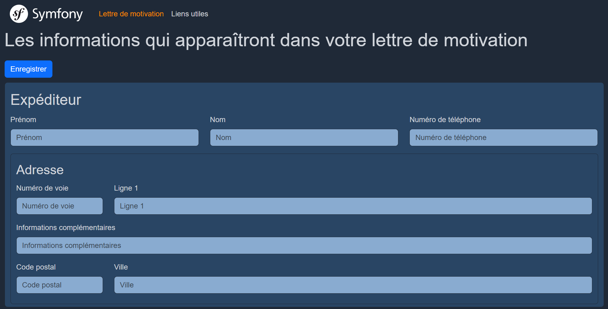
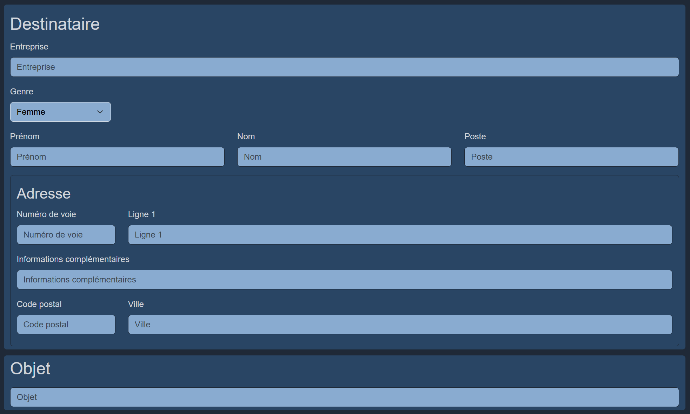
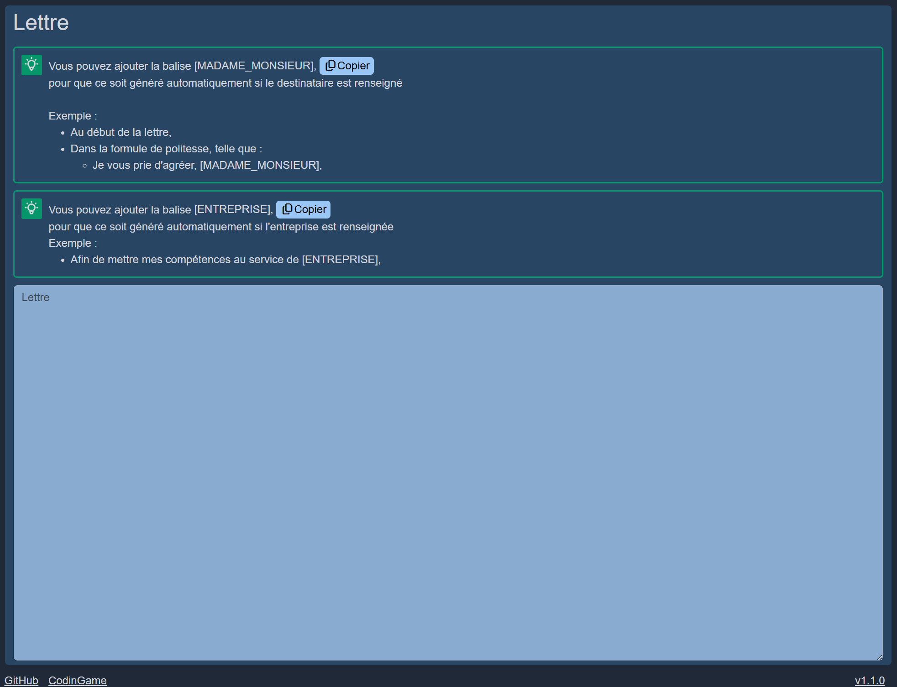

# Recherche d'emploi


Outil pour générer des lettres de motivation en PDF et regrouper des liens utiles aux développeurs.

## Fonctionnalités

- Back-office pour la création de lettres de motivation.
- Génération de ces lettres en PDF avec `KnpSnappyBundle`.

## Prérequis

- Git
- Docker et Docker Compose

## Captures d’écran





## Contact

Retrouvez-moi sur [LinkedIn](https://www.linkedin.com/in/mathias-daverede) pour discuter de ce projet ou d'opportunités professionnelles !

> [!IMPORTANT]
> Le dossier du projet est monté en tant que données persistantes,  
> ce qui signifie que tout ce que vous ajoutez/modifiez/supprimez dans /var/www/ (du conteneur),  
> le sera également dans le dossier du projet !
>
> **Extrait de [compose.yaml](compose.yaml) :**
>
> ```yaml
> services:
>   web:
>     volumes:
>       - .:/var/www/
> ```

## Sommaire

[Versions du projet](#versions-du-projet)  
[Comment l'utiliser](#comment-lutiliser)  
[Démarrer le projet](#démarrer-le-projet)  
[Accéder au projet](#accéder-au-projet)  
[Modifier le projet](#modifier-le-projet)  
[Tests unitaires](#tests-unitaires)

## Versions du projet

Créé depuis un environnement Windows 11 / WSL2 (Ubuntu 24.04).

### Docker

Docker version 28.1.1  
Docker Compose version v2.35.1-desktop.1

### Images

Reverse proxy : Traefik 3.4.0  
Web : Debian 12.12 (Bookworm 12)  
Database : MariaDB 11.7.2 / PhpMyAdmin 5.2.2-apache

### Projet

Composer 2.2.25  
Symfony 7.3  
Php 8.2

### Bundles installés via Composer

[Sass 0.8.3](https://packagist.org/packages/symfonycasts/sass-bundle)  
`composer require symfonycasts/sass-bundle`

[DoctrineFixtures 4.3](https://packagist.org/packages/doctrine/doctrine-fixtures-bundle)  
`composer require --dev doctrine/doctrine-fixtures-bundle`

[KnpSnappy 1.10](https://packagist.org/packages/knplabs/knp-snappy-bundle)  
`composer require knplabs/knp-snappy-bundle`

### Assets installées via importmap

[Bootstrap 5.3.8](https://www.npmjs.com/package/bootstrap)  
`bin/console importmap:require bootstrap`

- Installe automatiquement "@popperjs/core 2.11.8".

[Fontawesome-free 7.1.0](https://www.npmjs.com/package/@fortawesome/fontawesome-free)  
`bin/console importmap:require @fortawesome/fontawesome-free/css/all.min.css`

- Nous prenons seulement le fichier "all.min.css" du package (pour éviter des bugs).

## Comment l'utiliser

[Retour au sommaire](#sommaire)

Clonez le projet :  
`git clone git@github.com:MathiasDaverede/job-search.git`

## Créez un fichier .env.local à la racine du projet

Symfony charge d'abord .env, puis .env.local (s'il existe),  
et remplace les variables identiques par celles de .env.local pour l'environnement local.

Il faut quand même, au minimum, les données dont docker aura besoin puisqu'on utilisera par la suite la commande :  
`docker compose --env-file .env.local up -d`

### Données utilisateur

Pour que lorsque vous lancez des commandes qui écrivent des fichiers dans le projet,  
telles que `bin/console make:entity`,  
les fichiers soient écrits avec les mêmes droits que l'utilisateur connecté sur le système hôte

USER_NAME=votre_nom_d_utilisateur (`whoami`)  
USER_ID=votre_uid (`id -u`)  
GROUP_ID=votre_gid (`id -g`)

### Données pour la base de données

MARIADB_ROOT_PASSWORD=un_mot_de_passe  
MARIADB_DATABASE_NAME=un_nom_pour_la_base_de_donnees

## Démarrer le projet

[Retour au sommaire](#sommaire)

Placez-vous dans le projet :  
`cd emplacement/job-search/`

> [!CAUTION]
> Selon comment vous avez cloné le projet,  
> il se peut que les fichiers exécutables ne le soient pas (SourceTree sur Windows avec Ubuntu (WSL)).

```bash
# Vérifiez les droits des fichiers
ls -l bin/

# Rendre les fichiers exécutables
chmod +x bin/*
```

Construisez les images et démarrez les conteneurs en mode détachés :  
`docker compose --env-file .env.local up -d`

- Il arrive que ça plante car l'un des serveurs ne répont (momentanément) pas.  
   Si c'est le cas, relancez la commande.

Si par la suite, vous modifiez le Dockerfile,  
ou que vous avez oublié de créer le .env.local avant de lancer la commande up
vous devrez lancez la commande build,
c.-à-d. :
Soit :

```bash
docker compose --env-file .env.local build
docker compose --env-file .env.local up -d
```

Soit :  
`docker compose --env-file .env.local up --build -d`

Accédez au conteneur web lorsqu'il est démarré (Container job-search-web-1 Started) :  
`docker exec -it job-search-web-1 bash`

Puis lancez les commandes :

Installation des dépendances Symfony :  
`composer install`

Mise à jour de la base de données  
(déjà créée automatiquement lors du premier démarrage de son conteneur) :  
`bin/console doctrine:migrations:migrate --no-interaction`

Génération des assets Sass :  
`bin/console sass:build`

Contrôle de l'installation  
(éléments requis et audit) :  
`symfony check:requirements`  
`symfony check:security`  
`bin/console importmap:audit`

## Accéder au projet

[Retour au sommaire](#sommaire)

Si les conteneurs sont stoppés (vous reprenez le projet un autre jour ou vous redémarrez votre PC),  
relancez la commande :  
`docker compose --env-file .env.local up -d`

Vérifiez leurs états :  
`docker ps`

### Pages web

[Page "placeholder" Symfony 7.3](http://jobsearch.localhost)  
[Lettre de motivation](http://jobsearch.localhost/lettre-de-motivation)

[Traefik (reverse proxy)](http://traefik.localhost:8080/dashboard/#/)  
[PhpMyAdmin](http://phpmyadmin.localhost)

### Conteneurs

Syntaxe pour accéder au conteneur :  
`docker exec -it nom_conteneur bash`

Listez les conteneurs lancés :  
`docker ps`  

> Nom des conteneurs (colonne NAMES) :  
> job-search-web-1  
> job-search-database-1

```bash
# Le projet web basé sur le Dockerfile (Symfony/Php/Apache2/etc.)
docker exec -it job-search-web-1 bash

# La base de donnée  MariaDB  
docker exec -it job-search-database-1 bash
```

## Modifier le projet

[Retour au sommaire](#sommaire)

Placez vous dans le projet :  
`cd emplacement/job-search/`

Etant donné que c'est un projet basé sur le Framework Symfony,  
si vous modifiez les entités (ou que vous en ajoutez de nouvelles),  
lancez la commande :  
`bin/console make:migration`

- Pour ajouter les modifications au versioning (migrations/).

Pour prendre en compte ces modifications,  
lancez la commande :  
`bin/console doctrine:migrations:migrate --no-interaction`

Alternative (développement uniquement),  
pour des tests rapides en développement local,  
À la place des deux commandes précédentes,  
vous pouvez utiliser :  
`bin/console doctrine:schema:update --force`

Si vous modifiez l'un des fichiers Sass (.scss),
lancez la commande (une fois) :  
`bin/console sass:build --watch`

- Tant que le terminal est ouvert avec la commande lancée dedans,  
  vos modifications seront mises à jour automatiquement.
- Ctrl + c pour quitter

Si vous ajoutez des fichiers Sass,  
ajoutez le chemin du fichier dans [symfonycasts_sass.yaml](config/packages/symfonycasts_sass.yaml),  
puis, relancez la commande :  
`bin/console sass:build --watch`

## Tests unitaires

[Retour au sommaire](#sommaire)

> [!NOTE]
> Ces commandes sont à lancer dans le conteneur du projet :  
> `docker exec -it job-search-web-1 bash`

Création de la base de données de test :  
`bin/console --env=test doctrine:database:create`

Création des tables/colonnes dans la base de données de test :  
`bin/console --env=test doctrine:schema:create`

Initialisation de la base de données de test :  
`bin/console --env=test doctrine:fixtures:load --no-interaction`

Lancement des tests :  
`bin/phpunit`

Pour information, la création d'un test unitaire se fait grâce à la commande :  
`bin/console make:test`
