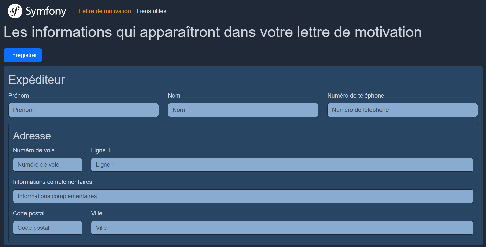
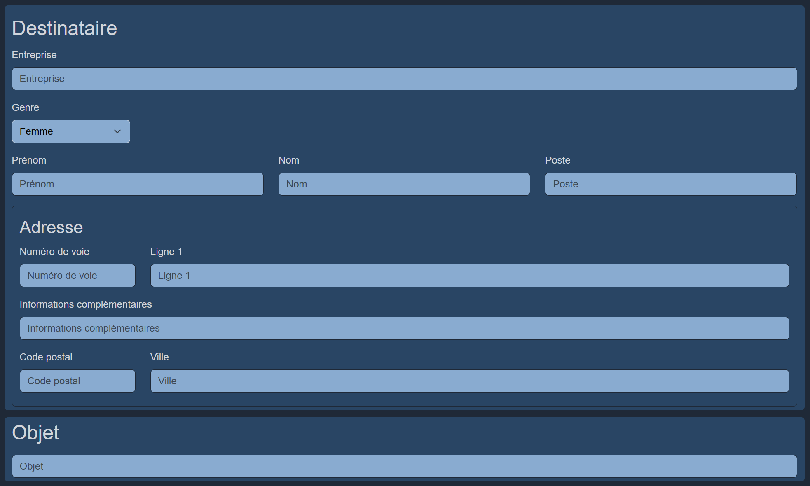
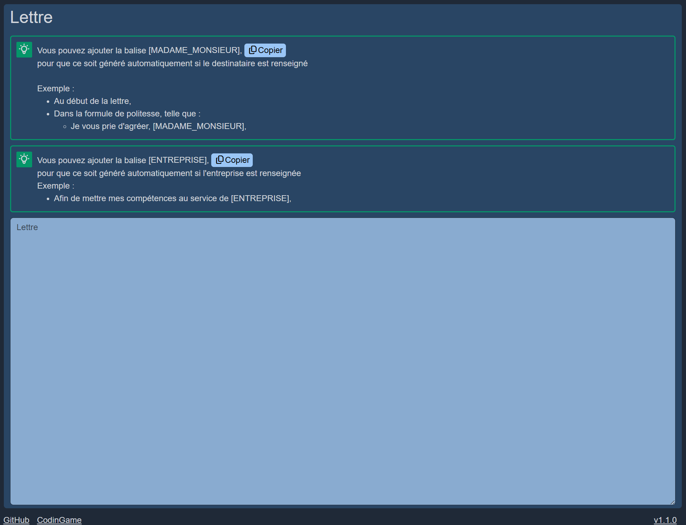

# Recherche d'emploi


Outil pour générer des lettres de motivation en PDF et regrouper des liens utiles pour développeurs.

## Fonctionnalités

- Back-office pour créer des lettres de motivation.
- Génération de ces lettres en PDF avec `KnpSnappyBundle`.
- Liens utiles pour les développeurs.

## Prérequis

- Git
- Docker et Docker Compose

## Captures d’écran





## Contact

Retrouvez-moi sur [LinkedIn](https://www.linkedin.com/in/<ton-profil>) pour discuter de ce projet ou d’opportunités professionnelles !

> [!IMPORTANT]
> Le dossier du projet est monté en tant que données persistantes.  
> Ce qui signifie que tout ce que vous ajoutez/modifiez/supprimez dans /var/www/ (du conteneur),  
> le sera également dans le dossier du projet !
>
> - compose.yaml :
>   - services:
>     - web:
>       - volumes:
>         - .:/var/www/

[Versions du projet](#versions-du-projet)  
[Comment l'utiliser](#comment-lutiliser)  
[Démarrer le projet](#démarrer-le-projet)  
[Accéder au projet](#accéder-au-projet)  
[Modifier le projet](#modifier-le-projet)  
[Tests unitaires](#tests-unitaires)  
[Git](#git)

## Versions du projet

Créé depuis un environnement Windows 11 /WSL2 (Ubuntu 24.04).

### Docker

Docker version 28.1.1  
Docker Compose version v2.35.1-desktop.1

### Images

Reverse proxy : Traefik 3.4.0  
Web : Debian 12.12 (Bookworm 12)  
Database : MariaDB 11.7.2 / PhpMyAdmin 5.2.2-apache

### Projet

Composer 2.2.25  
Symfony 7.3  
Php 8.2

### Bundles installés via Composer

[Sass 0.8.3](https://packagist.org/packages/symfonycasts/sass-bundle)  
`composer require symfonycasts/sass-bundle`

[DoctrineFixtures 4.2](https://packagist.org/packages/doctrine/doctrine-fixtures-bundle)  
`composer require --dev doctrine/doctrine-fixtures-bundle`

[KnpSnappy 1.10](https://packagist.org/packages/knplabs/knp-snappy-bundle)  
`composer require knplabs/knp-snappy-bundle`

### Assets installées via importmap

[Bootstrap 5.3.8](https://www.npmjs.com/package/bootstrap)  
`bin/console importmap:require bootstrap`

- Installe automatiquement "@popperjs/core 2.11.8".

[Fontawesome-free 7.1.0](https://www.npmjs.com/package/@fortawesome/fontawesome-free)  
`bin/console importmap:require @fortawesome/fontawesome-free/css/all.min.css`

- On ne prend que le all.min.css du package, j'avais des bugs sinon

## Comment l'utiliser

[Retour en haut de page](#recherche-demploi)

Clonez le projet :  
`git clone git@github.com:MathiasDaverede/job-search.git`

## Créez un fichier .env.local à la racine du projet

Symfony charge d'abord .env, puis .env.local (s'il existe),  
en remplaçant les variables identiques par celles de .env.local pour l'environnement local.

Il faut quand même, au minimum, les données dont docker aura besoin puisqu'on utilisera par la suite la commande :  
`docker compose --env-file .env.local up -d`

### Données utilisateur

Pour que lorsque vous lancez des commandes qui écrivent des fichiers dans le projet,  
telles que `bin/console make:entity`,  
les fichiers soient écrit avec les même droits que l'utilisateur connecté sur le système hôte

USER_NAME=votre_nom_d_utilisateur (`whoami`)  
USER_ID=votre_uid (`id -u`)  
GROUP_ID=votre_gid (`id -g`)

### Données pour la base de données

MARIADB_ROOT_PASSWORD=un_mot_de_passe  
MARIADB_DATABASE_NAME=un_nom_pour_la_base_de_donnees

## Démarrer le projet

[Retour en haut de page](#recherche-demploi)

Placez vous dans le projet :  
`cd emplacement/job-search/`

Selon comment vous avez cloné le projet, il se peut que les fichiers exécutables ne le soient pas (SourceTree sur Windows avec Ubuntu (WSL)).  
Vérifiez les droits des fichiers :

```bash
ls -l bin/
ls -l docker/bin/
```

Si les fichiers ne sont pas exécutables :

```bash
chmod +x bin/*
chmod +x .github/bin/*
```

Construisez les images et démarrez les conteneurs en mode détachés :  
`docker compose --env-file .env.local up -d`

- Il arrive que ça plante car l'un des serveurs ne répont (momentanément) pas.  
   Si c'est le cas, relancez la commande.

Si par la suite vous modifiez le Dockerfile,  
ou que vous avez oublié de créer le .env.local avant de lancer la commande up
vous devrez lancez la commande build,
c.-à-d. :
Soit :

```bash
docker compose build
docker compose --env-file .env.local up -d
```

Soit :  
`docker compose --env-file .env.local up --build -d`

Accédez au conteneur web lorsqu'il est démarré (Container job-search-web-1 Started) :  
`docker exec -it job-search-web-1 bash`

Puis lancez les commandes :

Installation des dépendances Symfony :  
`composer install`

> [!NOTE]
> La commande `composer install`  se base sur les fichiers composer.lock et symfony.lock.  
> Composer commence par lire composer.lock.  
> Ensuite, Symfony Flex intervient (si activé dans le projet)  
  et utilise symfony.lock pour appliquer les recettes associées à ces dépendances.
>
> - composer.lock
>   - Contient les versions exactes des dépendances PHP (packages et leurs sous-dépendances)  
      installées dans le projet.
>   - Composer lit composer.lock (s'il existe) pour installer les versions précises des dépendances listées,  
>     ignorant les contraintes de version du composer.json pour ces dépendances.  
>     - Si composer.lock n’existe pas,  
>       Composer utilise les contraintes du composer.json pour télécharger les versions compatibles  
>       et crée un nouveau composer.lock.
> - symfony.lock
>   - Spécifique à Symfony Flex,  
>     enregistre les versions des recettes (fichiers de configuration automatisés) associées aux packages installés.  
>     Ces recettes configurent les bundles, créent des fichiers (comme config/packages/*.yaml),  
>     ou modifient des fichiers comme .gitignore.
>     - Symfony Flex, qui est un plugin de Composer,  
>       lit symfony.lock pour appliquer les recettes dans l’état exact où elles ont été installées initialement.  
>       Cela garantit que les configurations spécifiques à Symfony (comme les fichiers de configuration ou les scripts d’initialisation)  
>       sont appliquées de manière cohérente.
>
> En résumé :  
> composer.lock s’occupe des dépendances (les bibliothèques PHP elles-mêmes).  
> symfony.lock s’occupe des configurations (recettes) appliquées à ces dépendances pour intégrer correctement les bundles ou packages.
>
> La commande `composer install` lance également les commandes :
>
> - `bin/console cache:clear`
>   - Vide le cache (var/cache/).
> - `bin/console assets:install public`
>   - Copie les fichiers statiques des bundles installés (fichier composer.lock)  
      dans le dossier "public/bundles/".
> - `bin/console importmap:install`
>   - Installe les dépendances Javascript/CSS (fichier importmap.php)  
      dans le dossier "assets/vendor/".

Mise à jour de la base de données  
(déjà créée automatiquement lors du premier démarrage de son conteneur) :  
`bin/console doctrine:migrations:migrate --no-interaction`

Génération des assets Sass :  
`bin/console sass:build`

Contrôle de l'installation  
(éléments requis et audit) :  
`symfony check:requirements`  
`symfony check:security`  
`bin/console importmap:audit`

## Accéder au projet

[Retour en haut de page](#recherche-demploi)

Si les conteneurs sont stoppés (vous reprenez le projet un autre jour ou vous redémarrer votre pc),  
relancez la commande :  
`docker compose --env-file .env.local up -d`

Vérifiez leurs états :  
`docker ps`

### Pages web

[Page "placeholder" Symfony 7.3](http://jobsearch.localhost)  
[Lettre de motivation](http://jobsearch.localhost/lettre-de-motivation)

[Traefik (reverse proxy)](http://traefik.localhost:8080/dashboard/#/)  
[PhpMyAdmin](http://phpmyadmin.localhost)

### Conteneurs

Syntaxe pour accéder au conteneur :  
`docker exec -it nom_conteneur bash`

Listez les conteneurs lancés :  
`docker ps`  

> Nom des conteneurs (colonne NAMES) :  
> job-search-web-1  
> job-search-database-1

```bash
# Le projet web basé sur le Dockerfile (Symfony/Php/Apache2/etc.)
docker exec -it job-search-web-1 bash

# La base de donnée  MariaDB  
docker exec -it job-search-database-1 bash
```

## Modifier le projet

[Retour en haut de page](#recherche-demploi)

Placez vous dans le projet :  
`cd emplacement/job-search/`

Etant donné que c'est un projet basé sur le Framework Symfony,  
si vous modifiez les entités (ou que vous en ajoutez de nouvelles),  
lancez la commande :  
`bin/console make:migration`

- Pour ajouter les modifications au versioning (migrations/).

Pour prendre en compte ces modifications,  
lancez la commande :  
`bin/console doctrine:migrations:migrate`  

Alternative (développement uniquement),  
pour des tests rapides en développement local,  
À la place des deux commandes précédentes,  
vous pouvez utiliser :  
`bin/console doctrine:schema:update --force`  

Si vous modifiez l'un des fichiers Sass (.scss),
lancez la commande (une fois) :  
`bin/console sass:build --watch`

- Tant que le terminal est ouvert avec la commande lancée dedans,  
  vos modifications seront mises à jour automatiquement.

## Tests unitaires

[Retour en haut de page](#recherche-demploi)

Les tests unitaires sont lancés automatiquement lors de la création de pull requests sur Github.  
Les commandes lancées, que vous pouvez retrouver dans le fichier [project.yml](https://github.com/MathiasDaverede/job-search/blob/main/.github/workflows/project.yml), sont :

> [!NOTE]
> Ces commandes sont à lancer dans le conteneur du projet :  
> `docker exec -it job-search-web-1 bash`

Création de la base de données de test :  
`bin/console --env=test doctrine:database:create`

Création des tables/colonnes dans la base de données de test :  
`bin/console --env=test doctrine:schema:create`

Initialisation de la base de données de test :  
`bin/console --env=test doctrine:fixtures:load`

Lancement des tests :  
`bin/phpunit`

Pour information, la création d'un test unitaire ce fait grâce à la commande :  
`bin/console make:test`

TODO à compléter améliorer

## Git

PR : Pull Request

### Github

#### Paramétrage

Création d'un repository.  
Protection des branches develop et main :

- Settings (du repository) >
  - Rules > Rulesets > New ruleset
    - Require a pull request before merging
  - Actions > General > Workflow permissions
    - Allow GitHub Actions to create and approve pull requests

#### Actions

Description de la CI (Github Actions) mise en place :

[project.yml](https://github.com/MathiasDaverede/job-search/blob/main/.github/workflows/project.yml)

Se lance à chaque PR, créée ou mise à jour, d'une branche vers develop ou vers main

- Test du projet
  - installation des dépendances
  - mise à jour de la base de données
  - audit et vérifications
  - tests unitaires

[version-changelog.yml](https://github.com/MathiasDaverede/job-search/blob/main/.github/workflows/version-changelog.yml)

Se lance à chaque PR, créée ou mise à jour, d'une branche (release ou hotfix) vers main

- Mise à jour des fichiers VERSION.md et CHANGELOG.md

TODO
CI on PR opened sinchronise : auto generation de version et changelog
le changelog se base sur le titre des PRS car modifiable même une fois fermés
en cas d'erreurs, il sera toujours possible d'avoir un changelog propre

[tag-release.yml](https://github.com/MathiasDaverede/job-search/blob/main/.github/workflows/tag-release.yml)

Se lance à chaque PR mergée vers main

- Création d'un tag et d'une release

[merged-branches.yml](https://github.com/MathiasDaverede/job-search/blob/main/.github/workflows/merged-branches.yml)

Se lance à chaque PR mergée

- Feature mergée sur develop
  - suppression de la branche
- Release (ou hotfix) mergée sur main
  - création d'une "pull request" de la branche vers develop pour synchronisation
- Release (ou hotfix) mergée sur develop
  - suppression de la branche

### Git flow

J'utilise personnellement SourceTree sur Windows qui gère le projet sur Ubuntu (WSL)  
Mais voici un résumé d'un cycle de vie :

Création d'issues sur le repository en fonction des besoins (ajout de fonctionnalités, correction de bugs)

#### Feature

Nouvelle fonctionnalité

Création d'une branche feature/[issue_number]-feature-name à partir de develop.

- feature/1-my-first-feature

Développement de la fonctionnalité

Exemple de commits :

- feat: my first feature [closes #1]
- docs: update README.md [refs #1]
- chore : unit tests [refs #1]

puis on pousse la branche sur le dépot.

On créé ensuite une PR de cette branche vers develop,

- titre : feat: my first feature [closes #1]
- description : description de la nouvelle fonctionnalité si besoin

on résout les conflits potentiels (en mettant à jour notre branche develop puis en la mergeant dans notre feature puis re push),
on attend que les tests de la CI soient validés.

TODO à voir :
puis on "Squash and merge" avec le message

- feat: my first feature [closes #1]

### Release

Contient les fonctionnalités (features) à déployer

> [!NOTE]
> Étant donné que les branches main et develop sont protégées (pull requests only)  
> On ne peut pas utiliser la fonctionnalité git flow `git flow release finish 'X.Y.Z'`  
> qui merge la release dans main, puis dans develop, puis la supprime

Création d'une branche release/X.Y.Z à partir de develop (qui contient les nouvelles features).
release/1.0.0

Déploiement de la release sur un environnement de test (pré-prod).

Après validation du bon fonctionnement des fonctionnalités contenues dans la release,  
ouverture d'une PR de release/X.Y.Z vers main.  
titre : Release 1.0.0  
description : la liste des features contenues

on résout les conflits potentiels (en mergeant main dans notre release puis re push),  
on attend que les tests de la CI soient validés (tests du projet + mise à jour des .md).

puis on "Create a merge commit"

Ca va créer automatiquement une PR de la release vers develop (via la CI)  
on résout les conflits potentiels

- en mettant à jour notre branche release/ locale (la mise à jour auto des .md a généré un commit)
- en mergeant develop dans notre branche
- puis re push

puis on "Create a merge commit"

### Hotfix

Même principe qu'une release sauf qu'il contient une ou plusieurs correction de bug important qu'il faut corriger rapidement.

Création d'une branche hotfix/X.Y.Z à partir de main.
hotfix/1.0.1

TODO puis pareil que release
